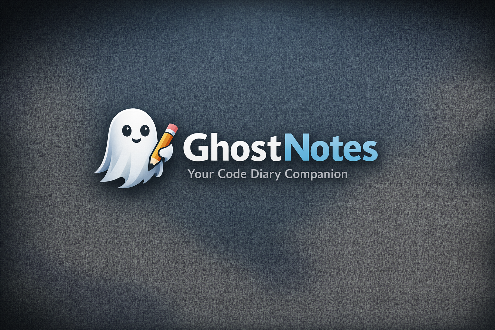
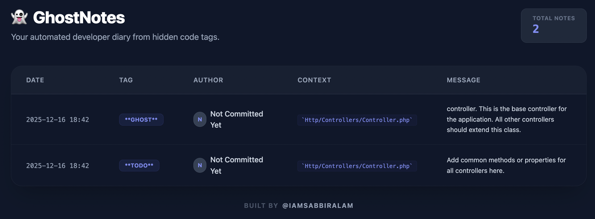

# 👻 GhostNotes - Transform Code Comments into a Dev Diary

[](https://packagist.org/packages/iamsabbiralam/ghost-notes)
[](https://packagist.org/packages/iamsabbiralam/ghost-notes)
[](https://packagist.org/packages/iamsabbiralam/ghost-notes)

**GhostNotes** is a lightweight, powerful Laravel utility that scans your codebase for hidden tags like `@ghost`, `@todo`, or `@fixme` and compiles them into a beautiful, organized Markdown developer diary and a modern Web Dashboard.



---

## ✨ Features

- 🔍 **Multi-Tag Scanning:** Automatically finds `@ghost:`, `@todo:`, `@fixme:`, and `@note:` tags.
- 👤 **Git Integration:** Uses `git blame` to automatically identify the author of each note.
- 🧹 **Code Cleanup:** Optional `--clear` flag to remove tags from your source code after generating the diary.
- 🎨 **Modern Dashboard:** A built-in Tailwind CSS dashboard to view your notes in the browser.
- ⚙️ **Fully Configurable:** Customize tags, ignored folders, and output filenames.
- 🔒 **Security:** Dashboard is automatically disabled in production environments.

---

## 🚀 Installation

You can install the package via composer:

```bash
composer require iamsabbiralam/ghost-notes
```

After installation, publish the configuration file:
```
php artisan vendor:publish --tag="ghost-notes-config"
```

## 🛠 Usage
1. Adding Notes in Code

Add comments anywhere in your PHP files:
```
// @ghost: Refactor this logic after the API update
// @todo: Add validation for the email field
// @fixme: Fixing the ghost-button alignment issue
```

1. Generating the Diary

Run the following command to scan your files and create ```GHOST_LOG.md```:
```bash
php artisan ghost:write
```

3. Cleaning Up

If you want to move the notes to the diary and remove them from your code files:
```bash
php artisan ghost:write --clear
```

4. Viewing the Dashboard

Simply visit the following URL in your local browser: ```http://your-app.test/ghost-notes```



## ⚙️ Configuration
The published config file ```(config/ghost-notes.php)``` allows you to customize:
```bash
return [
    'tags' => ['@ghost', '@todo', '@fixme', '@note'],
    'filename' => 'GHOST_LOG.md',
    'ignore_folders' => ['vendor', 'node_modules', 'storage', 'tests'],
    'git_context' => true,
];
```

## 🤝 Contributing
Contributions are welcome! If you have any ideas or find bugs, please open an issue or submit a pull request.

## 📄 License
The MIT License (MIT). Please see License File for more information.

Created with by [Sabbir Alam](https://github.com/iamsabbiralam)
