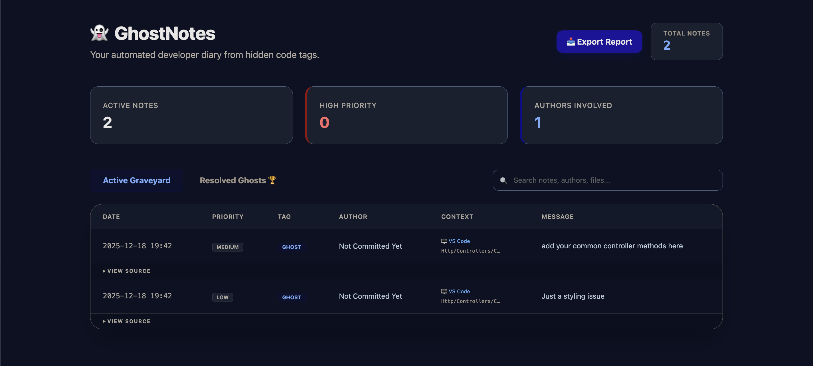

# 👻 GhostNotes - Transform Code Comments into a Dev Diary

[](https://packagist.org/packages/iamsabbiralam/ghost-notes)
[](https://packagist.org/packages/iamsabbiralam/ghost-notes)
[](https://packagist.org/packages/iamsabbiralam/ghost-notes)


**GhostNotes** is a powerful Laravel utility that scans your codebase for hidden tags like `@ghost`, `@todo`, or `@fixme` and compiles them into a beautiful, organized developer diary, multi-format reports, and a modern Web Dashboard.



---

## ✨ Features

- 🔍 **Advanced Tag Scanning:** Automatically finds `@ghost`, `@todo`, `@fixme`, and `@note` with optional **Priority Levels** (high|medium|low).
- 🎨 **Modern Dashboard:** A sleek, Tailwind-powered dashboard with **Search**, **Priority Badges**, and **Source Code Snippets**.
- 📊 **Multi-Format Export:** Export your dev-diary into **Markdown**, **JSON**, or **CSV** (Excel compatible).
- 🏆 **Resolved Graveyard:** Track resolved notes in the "Resolved Ghosts" history after clearing them from your code.
- 🚀 **VS Code & GitHub Integration:** Open files directly in VS Code from the dashboard or view them on GitHub with line-specific links.
- 👤 **Git Context:** Automatically identifies the author using `git blame`.
- 🧹 **Code Cleanup:** Use the `--clear` flag to safely remove tags from source code once they are logged.
- 🔒 **Safe for Devs:** Dashboard and routes are automatically disabled in production.

---

## 🚀 Installation

Install the package via composer:

```bash
composer require iamsabbiralam/ghost-notes
```
Set up everything with a single command:
```bash
php artisan ghost:install
```
This command publishes the config file and prepares the internal storage.

---

## 🛠 Usage
1. Adding Tags in Code
You can now add priority levels to your tags:
```bash
// @ghost:high: Fix this critical security vulnerability
// @todo:medium: Implement the user profile update logic
// @fixme:low: Minor alignment issue on the footer
// @note: This is a general architectural note
```
2. Generating the Diary
Run the command to scan files and update the dashboard cache:
```bash
php artisan ghost:write
```
3. Exporting Reports
Generate reports in your preferred format:
```bash
php artisan ghost:write --format=markdown
php artisan ghost:write --format=json
php artisan ghost:write --format=csv
```
4. Clearing and Archiving
Log the notes to the Resolved History and remove them from your code:
```bash
php artisan ghost:write --clear
```

---

## 🖥 Web Dashboard
Visit the interactive dashboard at: http://your-app.test/ghost-notes

In the Dashboard you can:
* 🔍 Search through notes by author, message, or file name.
* 🖱️ One-click Open files directly in VS Code.
* 📦 Download reports as CSV, JSON, or Markdown.
* 🖨️ Print a clean PDF report of your technical debt.
* 📜 View History of all resolved/cleared notes.

---

## ⚙️ Configuration
The configuration file ```(config/ghost-notes.php)``` allows you to customize:
```bash
return [
    'tags' => ['@ghost', '@todo', '@fixme', '@note'],
    'filename' => 'GHOST_LOG.md',
    'ignore_folders' => ['vendor', 'node_modules', 'storage', 'tests'],
    'git_context' => true,
    'repo_url' => env('GHOST_NOTES_REPO_URL', ''), // Auto-detected if empty
    'default_branch' => 'main',
];
```
---

## 🤝 Contributing
Contributions are welcome! If you have any ideas, feel free to open an issue or submit a pull request.

---

## 📄 License
The MIT License (MIT). Please see License File for more information.

Developed by [Sabbir Alam](https://github.com/iamsabbiralam)
