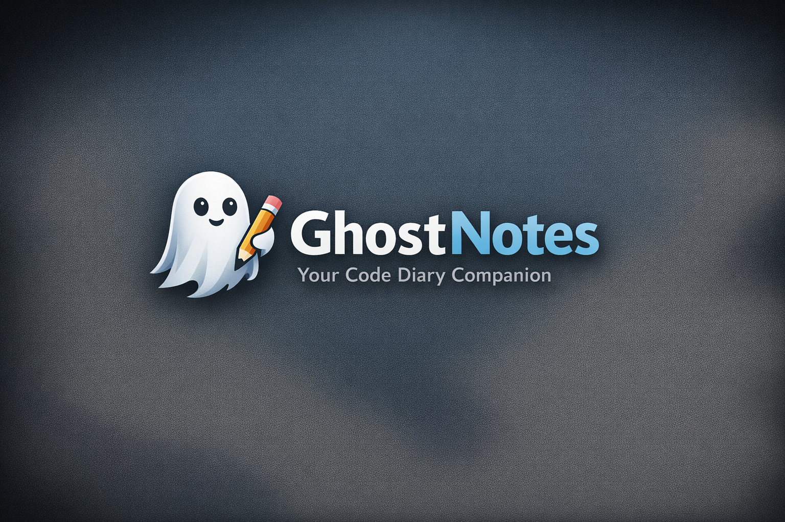
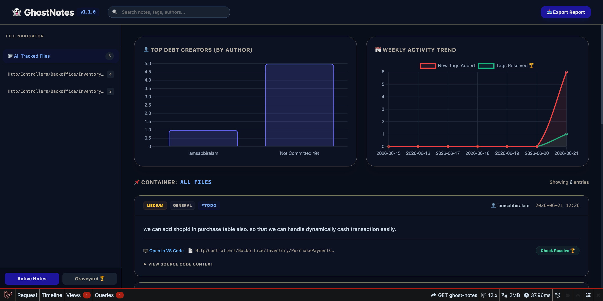

# 👻 GhostNotes - Transform Code Comments into a Dev Diary

[](https://packagist.org/packages/iamsabbiralam/ghost-notes)
[](https://packagist.org/packages/iamsabbiralam/ghost-notes)
[](https://packagist.org/packages/iamsabbiralam/ghost-notes)
[](https://laravel.com)



> 💡 **Tip for Devs:** Place a beautiful terminal-to-dashboard showcase GIF right here to skyrocket your GitHub Stars!

**GhostNotes** is a powerful Laravel utility that scans your codebase for hidden tags like `@ghost`, `@todo`, or `@fixme`, automatically parses their type/priority, and compiles them into a beautiful, organized developer diary, multi-format reports, and a modern two-column Split-View Web Dashboard.



---

## ✨ Features

- 🔍 **Advanced Tag Scanning:** Automatically finds `@ghost`, `@todo`, `@fixme`, and `@note` across multiple directories.
- 🏷️ **Type-Based Classification:** Group your debt into clear buckets using formats like `@ghost:fix`, `@ghost:feature`, or `@ghost:breaking`.
- 📊 **Priority Levels:** Assign critical tasks using priority modifiers (`:high`, `:medium`, `:low`).
- 🎨 **Premium Split-View Dashboard:** A modern, Telescope-like two-column layout featuring sidebar file navigation, quick searching, and interactive source code snippet expanders.
- 📋 Multi-Format Export:** Instantly export reports to **Markdown**, **JSON**, or **CSV** (Excel-compatible).
- 🏆 **Resolved Graveyard:** Automatically archives resolved entries into a "Resolved Ghosts" history board after code cleanup.
- 🚀 **VS Code & GitHub Integration:** One-click links to jump directly to the exact file line inside VS Code or open it on GitHub.
- 👤 **Git Context Awareness:** Automatically identifies the blame author using local `git blame`.
- 🧹 **Smart Code Cleanup:** Safely strips tags from source files via the `--clear` flag once they are logged.
- 🔒 **Safe Environment Protections:** Web dashboard access and route components are automatically disabled in production.

---

## 💻 Requirements & Compatibility

- **PHP:** `^8.0`
- **Laravel Framework:** `10.x`, `11.x`, and `12.x` (Fully Tested & Supported)

---

## 🚀 Installation

Install the package via composer:

```bash
composer require iamsabbiralam/ghost-notes
```
Set up everything with a single command:
```bash
php artisan ghost:install
```
This command publishes the configuration file and prepares internal architecture files.

🛠️ Usage
1. Adding Tags in Code
Write clean, organized notes by combining tags, specific types, and priority levels:
```bash
// Standard tag with category type and priority modifier:
// @ghost:feature:high: Implement API authentication system
// @ghost:fix: Crashing issue on checkout invoice action

// Works perfectly with standard developer tags too:
// @todo:medium: Implement the user profile file update logic
// @fixme: Minor styling alignment issue on the footer
// @note: This is a general architectural context reminder
```
2. Generating the Diary & Syncing Dashboard
Run the compiler command to parse your project codebase and sync the interactive cache:
```bash
php artisan ghost:write
```
3. Exporting Reports
Generate standard standalone report formats:
```bash
php artisan ghost:write --format=markdown
php artisan ghost:write --format=json
php artisan ghost:write --format=csv
```
4. Clearing and Archiving
Log active entries into the Resolved Graveyard history file and strip them out from source files safely:
```bash
php artisan ghost:write --clear
```
🖥️ Web Dashboard
Visit your interactive local GUI hub at: http://your-app.test/ghost-notes

Inside the Dashboard UI you can:

* 📂 File Navigator: Select specific controllers/files from the left panel to filter active entries seamlessly.

* 🔍 Smart Live Search: Filter notes on-the-fly by specific author name, category types, messages, or files.

* 🖱️ Deep Linking: Open target files directly onto your IDE workspace layout via VS Code protocols.

* 🖨️ Print Reports: Trigger a fully optimized blueprint layout stylesheet to print structured PDF portfolios.

⚙️ Configuration
Customize scanning scopes inside your published config/ghost-notes.php architecture profile:
```bash
return [
    'tags' => ['@ghost', '@todo', '@fixme', '@note'],
    'filename' => 'GHOST_LOG.md',
    
    // Directories to target during scans
    'scan_directories' => [
        'app',
        'routes',
        'resources/views',
    ],

    // File target extensions to check
    'allowed_extensions' => ['php', 'blade.php', 'js'],

    'ignore_folders' => ['vendor', 'node_modules', 'storage', 'tests'],
    'git_context' => true,
    'repo_url' => env('GHOST_NOTES_REPO_URL', ''), // Auto-detected if empty
    'default_branch' => 'main',
];
```
🤝 Contributing
Contributions are welcome! If you have any ideas, feel free to open an issue or submit a pull request.
📄 License
The MIT License (MIT). Please see the License File for more information.

Developed with ❤️ by [Sabbir Alam](https://www.github.com/iamsabbiralam)
